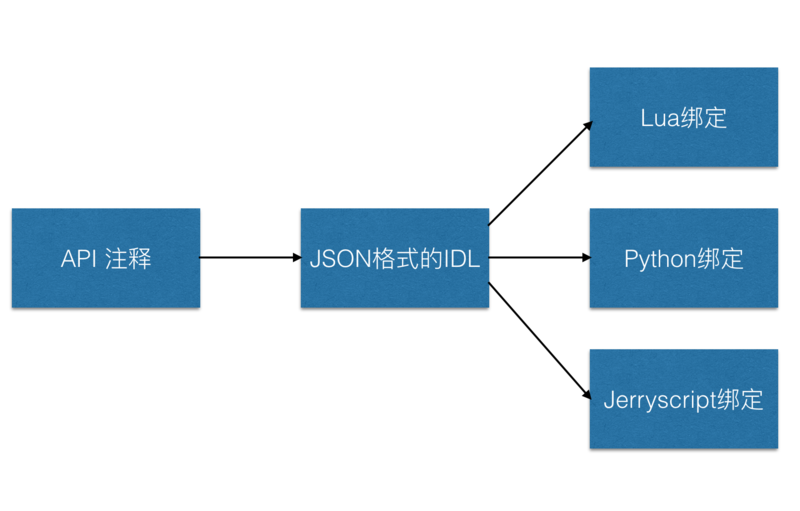

# AWTK脚本绑定的实现原理 - lua绑定

脚本化是[AWTK](https://github.com/zlgopen/awtk)的一个基本功能。[AWTK](https://github.com/zlgopen/awtk)计划支持嵌入式系统中常用的脚本，如lua、python和jerryscript。脚本绑定说简单也简单，说复杂也复杂，采用FFI(calling external C functions)和SWIG绑定一些简单的函数是很方便的，但绑定一个复杂的GUI系统还是很有挑战的。之所以不采用通用的工具，而是实现自己的代码产生器，主要有以下考虑：

* 我使用FFI和SWIG的经验很有限，觉得有些功能不太好实现，至少目前我还不知道实现这些功能的方法和思路。

* 担心FFI和SWIG的运行环境的可移植性。在Windows、Linux和Macos上肯定是没有问题的，但是在嵌入式系统，特别是RTOS和裸系统中，支持像动态库等功能可能有些困难的。

* 对jerryscript没有支持。jerryscript是三星开源的javascript实现，在嵌入式系统中用得比较多，通用的绑定机制对jerryscript没有支持。

* 代码风格。不同语言有不同的代码风格，特别是命名风格，直接把C言语的风格映射过去，对于开发者不太友好。FFI和SWIG都需要做额外的工作才能实现这个功能。

* AWTK采用面向对象设计，并用C实现面向对象编程的。而通用的绑定机制对此并不友好，实现起来非常困难。
 
* 自定义的代码产生器并不复杂，而且具有更大的灵活性。 

基于以上这些原因，我决定自己实现[AWTK](https://github.com/zlgopen/awtk)的脚本绑定机制。它的实现原理如下：用特定格式的API注释来描述要脚本化的API，用一个名为gen\_idl的工具把注释提取出来生成JSON的接口描述文件，然后用不同的代码产生器生成对应语言的绑定：

 

### 参考

1.[API注释格式](api_doc.md)

2.[JS绑定](https://github.com/zlgopen/awtk-js)

3.[Lua绑定](https://github.com/zlgopen/awtk-lua)
